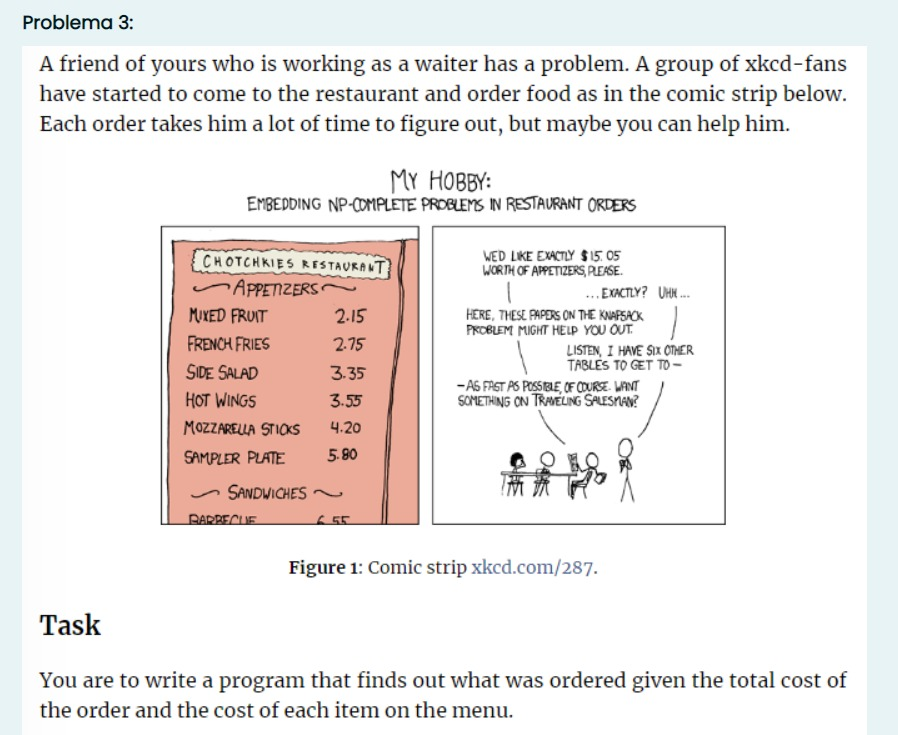
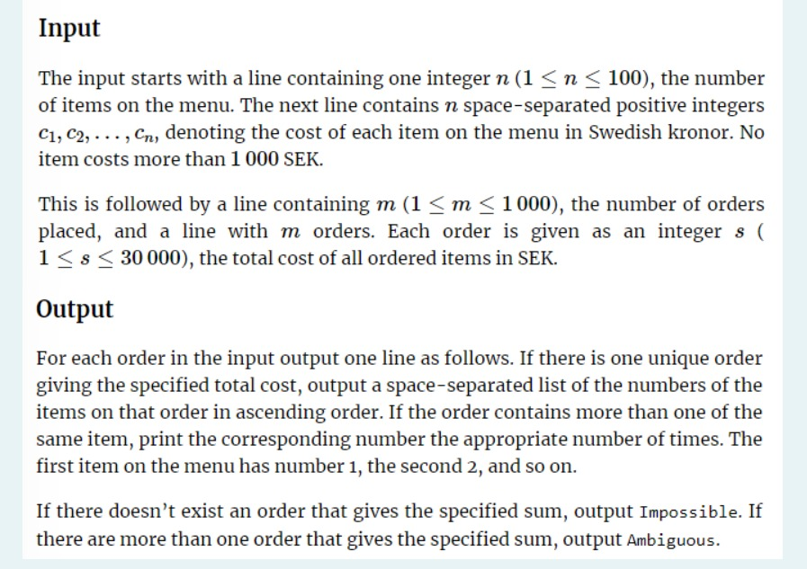

# ANALISIS DE ALGORITMOS

### Integrantes

| Nombre  | Carné  |
|:---|:---:|
|Daniel Vladimir Solis Marroquin | 00209020 |
|Carlos Eduardo Mercado Gutiérrez | 00058820 |
|José Miguel Acosta Vásquez|00008020|
|Diego José Rivas Fuentes|00121520|


# Ejercicio 1


El problema nos solicita encontrar el múltiplo máximo de subsecuencias de números consecutivos dentro de N secuencias principales de cantidades diferentes de números enteros.

> El rango definido para $X_i$ es: $\quad-99999 \le X_i \le 99999\quad\forall X_i\in\mathbb Z$
---
## Pseudocódigo

```
    Function Max 1D Range Product
        Input: Array, Size
        Output: Maximun product in subsequence of consecutive numbers in Array
        
        Memoization [Size]
        Product = 0
        for 2 to Size+1 do
            if Numbers are consecutive then
                Product = MAX (Product * Array [One before] OR Array [One before] * Array [Two before] )
            else Product = 0
            End If
        Memoization [Current position] = MAX ( Product OR Memoization [One before])
        End For
        
    Return Memoization [Size] 
```


---
## Implementación en C++

La solución que se utilizo para este problema, tiene como base el `max_1d_range_sum`. A partir de ahí, se le hicieron las modificaciones necesarias para poder retornar el dato solicitado. También se creo una función para generar el archivo que tiene las secuencias de números, que servirá como la entrada de datos a nuestro programa.

A continuación, las funciones implementadas en C++

### Función para generar archivo con números aleatorios

```c++
#include <time.h>
#include <fstream>

void create_rand_nums(string path, int lim, int subsequences)
{
    srand(time(NULL));
    fstream file(path, ios::out);
    for (int j = 0; j < subsequences; j++)
    {
        file << "{";
        for (int i = 0; i < lim; i++)
            file << -99999 + (rand() % ((2 * 99999) + 1)) << ",";
        file << -999999 << "}"
             << "\n";
    }
}
```

### Función principal

#### Código

```c++
int max_1d_range_product(int *A, int n) {
	int M[n + 1], P = 0;
    /*
    Se inicializa el arreglo M que se va a utilizar, aplicando la Memoization.

    También la variable P, que almacenará temporalmente el cálculo
    del mayor producto en el arreglo.
    */

    M[0] = 0;
    M[1] = A[0];
    /*
    Se queman la primera y segunda posición del arreglo A.

    Para este caso en particular, se quemara con un cero y con el primer elemento
    del arreglo original. Esto por si existe una secencia que contiene solamente uno
    o dos dígitos.
    */

    for (int i = 2; i <= n; i++)
    {
        /*
        La iteración de este algoritmo empezará en 2, puesto que se necesita saber las
        2 posiciones anteriores a la posicion del iterador para poder determinar el
        valor de P dependiendo de los casos que se presenten.
        */
        if (A[i - 1] == A[i - 2] + 1)
            /*
            Para saber si dos numeros son consecutivos en un arreglo A, basta con agregar
            una unidad a la posicion anterior de la actual y si los valores son los mismos,
            significa que uno va despues del otro, o sea, son consecutivos.
            */
            P = max(P * A[i - 1], A[i - 1] * A[i - 2]);
            /*
            En dado caso sí sean consecutivos, el nuevo valor de P viene designado por
            el valor máximo entre el valor actual de P multiplicado por el último dígito
            consecutivo conocido y el producto entre los dos últimos consecutivos.

            Esto se hace para saber si es mayor el producto entre dos números contiguos
            en el arreglo A después de que no sean consecutivos, o multiplicar el producto
            por el último consecutivo conocido.

            Por ejemplo, en la secuencia 4,5,6,9,10 el producto de 4*5*6 es mayor que
            el producto de 9*10, por tanto P = 4*5*6. Si la secuencia fuera 5,6,9,10
            P tendría un valor de P = 9*10, puesto que es mayor que 5*6.
            */
        else
            P = 0; // Si no son consecutivos, el producto total se reinicia a 0.

        M[i] = max(P, M[i - 1]);
        /*
        Finalmente, en la posicion i del arreglo M se almacenará el mayor
        entre el nuevo producto calculado o el anterior producto calculado.
        */
    }

    return M[n];
    /*
    Y retornamos el mayor producto calculado, que queda almacenado en la posición final
    del arreglo M.
    */
}

}
```

#### Instancias de ejemplo

```c++
    n = 10;
    int A[n] = {10, 1, -7, -6, 3, -9, 0, 2, -1, -5};
    int B[n] = {10, -31, 4, 9, 3, 20, 29, 2, -52, 8};
```

#### Main

```c++
int main() {

    cout << "El resultado maximo es: " << max_1d_range_product(A, n) << ".\n";
    cout << "El resultado maximo es: " << max_1d_range_product(B, n) << ".\n";

    return 0;
}
```

> El resultado maximo es: 42.  
> El resultado maximo es: 720.  
>   
> — Console Output   
---
## Modificaciones

### Modificacion 1 
El casino se ha dado cuenta que varios participantes aciertan muy facil la respuesta en este juego, por lo que deciden modificar las reglas.   

Ahora el limite de numeros en una secuencia dada es de 500 numeros. Ademas, los numeros solo pueden ser maximo de dos digitos. Para agregar una dificultad extra, ahora no es necesario que esten estrictamente consecutivos en el orden en el que aparecen en el arreglo original.

---
Para solucionarlo utilizando DP, se ordena el arreglo en una copia del original para no modificarlo, y a este arreglo ordenado se le pasa el mismo codigo. De esta forma, nos aseguramos de que si los numeros son consecutivos, esten juntos en el arreglo u se tomen en cuenta cuando el algoritmo se ejecute.
### Modificacion 2 
Bob esta sumamente agradecido contigo, gracias a tu solucion ha ganado mucho dinero, pero te contacta una vez mas. Le han ofrecido duplicar la cantidad que tiene si logra N instancias correctamente de nuevo, pero esta vez, tiene que indicar cual es la subsecuencia de numeros consecutivos que genera el resultado mayor.

---
Para resolverlo, se crea una estructura respuesta, en donde se guardaran cada uno de los valores que generen el mayor producto. Dicha string se modificara para sobreesrcibirse si el producto es mayor al actual. Si no, quedara igual.

# Ejercicio #2


## Seudocódigo del ejercicio "maximizing the diversity of a melody"

```
function  Max 1D Range Diversity
  Input 
  N -> Lenght of the song
  A -> Sequence of notes

  // M is an array which is the implementation of memoization.
  M[n];
  // When only one element is analyzed, we consider it a trivial case because the number of different values for arrays of data, regardless of what that data is, is always 1.
  M[0] = 1;
  
  // The path goes from 1 to n-1 since we already defined the solution for the trivial case i=0 and both sets "A" & "M" have size n.
  for 1 to n-1
    // Case when we have two consecutive equal integers
    if (Previous note is same as current note) {
      // The current integer is increased by one
      Current note++;
      // In the memoization array we advance to the next solution which will be equal to the previous solution increased by one, which symbolizes that a new distinct integer was found.
      Current solution = Previous solution + 1;      
    } 
    // Case when the integer found is less than the previous one
    else if (Previous note is greater than current note) {
    	// The current integer is increased by one
        Current note++;
	// In the memoization array we advance to the next solution which will be the same as the previous solution.
        Current solution = Previous solution;        
      }
    // Case when the integer found is greater than the previous one
    else
      // In the memoization array we advance to the next solution which will be equal to the previous solution increased by one, which symbolizes that a new distinct integer was found.
      Current solution = Previous solution + 1; 
  }															
  // Being a solution by dp, the response after execution is in the last position of our memoization data structure
  return Last Solution; 		
}
```


## Implementación en c++ de "maximizing the diversity of a melody"
```c++
#include <bits/stdc++.h>
using namespace std;

// Function prototype declarations
int max_1d_range_diversity(int* A, int n);
void fill_array(int* A, int n);

int main() {
  int t;
	// The number of tests is requested
  cout << "Enter the number of test" << endl;
  cin >> t;

  // Cycle to repeat and test the algorithm 't' times
  for (int i = t; i > 0; i--) {
    int n = 0;
    cout << "Enter the size of the array (n)" << endl;
    cin >> n;
    int A[n]; // An array as a data structure
    fill_array(A, n); // Calling the function to fill the array
    cout << "Maximum diversity: " << max_1d_range_diversity(A, n) << endl; // Print solution
  }
}

// Function to fill the array
void fill_array(int* A, int n){
    // Filling the values for x1 <= x2 <= x3 <=...<= xn
    cout << "Fill the values ascendant (Array)" << endl;
    for (int i = 0; i < n; i++) {
      cin >> A[i];
    }
}

// Function with the algorithm to calculate the maximum of differents elements with the condition given.
int max_1d_range_diversity(int* A, int n){

  int M[n]; 			// A solution array that contains the answers, this array is the memoization array.
  M[0] = 1;			// When there is only one data it is a trivial case because our diversity value will also be 1 with a single data.
  
  /*
We compare the current one with the previous one and since we know that
for an array of data there will be only one different
data (the same one), therefore we start the 'for' at 1
  */
  for (int i = 1; i < n; i++) {
    if (A[i - 1] == A[i]) {	// When numbers are the same
      A[i]++;   	    	// Add one to the current number
      M[i] = M[i - 1] + 1;      // And now we have one more diferent number
    } 
    else if (A[i - 1] > A[i]) { // When the number before is higher than the current number
        A[i]++;                 // Add one to the current number
        M[i] = M[i - 1];        // But we copy the previous result
      }
    else			// When the number before is neither the same nor higher
      M[i] = M[i - 1] + 1;      // Only one is added to the result, since they are different and the current number is greater than the previous one, as requested.
  }															

  return M[n-1]; 		// The maximum value is at the end of the M array
}
```

### Escenario de ejemplo
#### Input
```
Number of test: 1
Size of the array (n): 6
Values ascendant (Array): 2 2 2 3 4 5
```
Arreglo solicitado:
| i  | 0 | 1 | 2 | 3 | 4 | 5 |
| ------ | ------ | ------ | ------ | ------ | ------ | ------ |
| A  | 2 | 2 | 2 | 3 | 4 | 5 |

Donde la fila de i son los indices en el recorrido y A es el arreglo ingresado por el usuario.

#### Output
```
Maximum diversity: 5
```
Arreglo solucionado:
| i  | 0 | 1 | 2 | 3 | 4 | 5 |
| ------ | ------ | ------ | ------ | ------ | ------ | ------ |
| A  | 2 | 2 | 2 | 3 | 4 | 5 |
| M  | 1 | 2 | 2 | 3 | 4 | 5 |
| A' | 2 | 3 | 3 | 4 | 5 | 6 |

Donde M es el arreglo por `Memoization` y A' es el arreglo final "A" tras sufrir los aumentos.

## Modificaciones del ejercicio
### Modificacion 1 
Como primera modificación propuesta tenemos que podríamos modificar una de las condiciones que dictan que es lo que se pueden hacer con cada uno de los enteros, es decir nuestras condiciones actuales para cada entero son que solo es válido sumarle una unidad o dejarlo como está. Por tanto, podemos solicitar un número natural `m` por cada test y que este sustituya el valor de la unidad. En otras palabras, para cada entero las nuevas condiciones son dejarlo como está ó sumarle el número `m` antes definido por el usuario.
El motivo de esta variación se basa en que ahora el usuario quien ayuda a calcular el máximo de la diversidad entre las notas, tambien puede recibir un parámetro `m` que provoque una diversidad más alta por cada cambio en las notas (que son representadas como enteros), ya que sumarle 1 a una nota la hace menos o a lo sumo igual de diversa que sumarle un `m | m ∈ ℕ`.

---
Para solucionar esto utilizando DP, se propone una solución similar a la solución del problema base pero con leves variaciones. Estos cambios surgirian en las acciones tras las comparaciones `if` y `else if` donde en estos casos incrementabamos el valor de la posición actual del `arreglo original A` en 1, sin ambargo ahora debemos incrementarlo por el nuevo valor `m`. Esto se haría para ambas condiciones ya que por supuesto que siempre seguimos mantemiendo el requisito de que permanezcan los números enteros ascendentemente. 

### Modificacion 2 
Como segunda modificación, propongo que ahora surge un compositor que es muy creativo por lo que sus melodias tienen demasiada diversidad en sus notas, y justo en ese momento se requiere una melodia lo más tranquila y menos variada posible, en otras palabras ahora se requiere lo opuesto al ejercicio base ya que ahora tener diversidad en las notas es negativo. Por tanto, se busca minimizar la diverisadad en las notas lo que implica que al tomar las notas como enteros, se solicita que se *maximice la cantidad de elementos repetidos* en el arreglo que representa la melodia completa, siempre manteniendo las dos condiciones de modificación de los enteros del problema base (sumarle uno al entero actual o dejarlo como está).

---
Para solucionar esto utilizando DP, se propone una solución muy similar a la del problema base, esto ya que se utilizarían los mismos criterios de evaluación pero cambiaría la acción a realizar en caso de que se cumpla cada uno de ellos. Nuestro anterior `else` de la función `max_1d_range_diversity()`, que se encargaba de ver si habian dos elementos distintos consecutivos, simplemente avanzaba el `arreglo solución M` con el valor de 1 más la respuesta acumulada en la posición anterior del arreglo `(M(i-1))`, ya que encontraba un elemento distinto en la posición actual `(A(i))`. Sin embargo, para esta modificación esta acción intercambiaría con la acción que se ejecuata cuando se encontraban dos enteros iguales en el problema base. Esto ocurrirá de esta manera ya que nos interesa ir guardadndo una nueva solución en `M` cuando encontremos un entero igual al anterior en el `arreglo A`.

# Problema 3

## Enunciado



## Pseudocodigo
```
// Encuentra el mayor numero de elementos por orden con el algoritmo knapsack

n -> Numero de elementos en el menu
money[] -> Arreglo de precios del menu
m -> Cantidad de ordenes
orders[] -> Arreglo de precios de ordenes

knapsack(money[], n, m)
// Se guardaran tanto los datos de knapsack como el arreglo mas optimo
let dp[n+1] = 0
let response[n+1] = ""
let combinations

// Se utilizara un "Dato actual"
let current

// Bucle para recorrer en el orden de la cantidad de elementos
for i=1 to n
    // Bucle para recorrer el orden de la cantidad de pedidos
    for j=0 to m-1
        // En caso que el monto actual sea menor que el indice del monto final
        si money[j] <= i
            current -> j+1
        // En caso que el valor de knapsack actual sea menor que una instancia del dinero
        si dp[i] <= money[j] + dp[i - money[j]]
            response[i] -> response[i - money[j]] + current
        dp[i] -> max(dp[i], money[j] + dp[i - money[j]])
        si i=n
            combinations[i] -> response[i]

Se define la cantidad de combinaciones posibles que existen
let possible_combinations -> count(money, m, n)
```


## Implementacion en C++
```c++
#include <bits/stdc++.h>

using namespace std;

// Estrucuctura diseñada para el manejo de datos del algoritmo, con el fin de optimizar
// la respuesta del algoritmo al necesitar un valor de comparacion (max_value) y la
// combinacion de dinero mayor posible para cada orden (max_combi).
typedef struct
{
    int max_value;
    string max_combi;
    bool isAmbiguous;
} Answer;

// Funcion con el fin de imprimir un arreglo dados los datos (A[]) y el tamaño del mismo (n).
void printArray(int A[], int n)
{
    cout << "[";
    for (int i = 0; i < n; i++)
        cout << " " << A[i] << " ";
    cout << "]\n";
}

// Funcion con el fin de contar el numero de posibles soluciones de una sola orden.
int count(int coins[], int n, int sum)
{
    int i, j, x, y;

    // Se generara un arreglo bidimensional para el almacenamiento de todas las
    // posibles soluciones del arreglo dado el tamaño y el numero a encontrar.
    int table[sum + 1][n];

    // Se inicializan los primeros valores en 1 de cada subarreglo.
    for (i = 0; i < n; i++)
        table[0][i] = 1;

    // Se llena el resto del arreglo bidimensional desde mas hasta menos (bottom up).
    for (i = 1; i < sum + 1; i++)
    {
        for (j = 0; j < n; j++)
        {
            // Se cuentan las soluciones que incluyen el dinero del arreglo original.
            x = (i - coins[j] >= 0) ? table[i - coins[j]][j] : 0;

            // Se cuentan las soluciones excluyendo el dinero del arreglo original.
            y = (j >= 1) ? table[i][j - 1] : 0;

            // Se concatena el valor final hasta llegar a un concenso.
            table[i][j] = x + y;
        }
    }

    // Se retorna el ultimo valor de la tabla el cual indica la cantidad de soluciones posibles.
    return table[sum][n - 1];
}

// Funcion con algoritmo de knapsack, recibe los datos de precio de cada item del menu (money),
// el monto de la orden (n) y la cantidad de elementos del menu (m).
Answer knapsack(int *money, int n, int m)
{
    // Se declaran e inicializan los arreglos dp y response, los cuales contendran tanto el orden de
    // knapsack y el arreglo de combinacion ganador en caso de existir.
    int dp[n + 1] = {0};
    string response[n + 1] = {""};
    // Se delcara la variable string el cual apunta o almacena temporalmente el precio del menu
    // actual para su almacenamiento en response.
    string current;

    // Bucle for para recorrer el monto de la orden ingresada
    for (int i = 1; i <= n; i++)
    {
        // Bucle for para recorrer los montos del menu
        for (int j = 0; j < m; j++)
        {
            // Comparacion de cada precio del menu con respecto al monto de la orden actual, con el fin
            // de encontrar si cabe o no dentro de la cuenta actual.
            if (money[j] <= i)
            {
                // Se genera una cadena con los elementos actuales que caben dentro de la orden.
                current = to_string(j + 1) + ",";
                // Se compara el elemento actual en el vector de knapsack con un nuevo elemento del menu,
                // en caso de cumplir se agrega a la lista de items del menu final a mostrar.
                if (dp[i] <= money[j] + dp[i - money[j]])
                    response[i] = response[i - money[j]] + current;
                // Se compara entre los elementos actuales y sumando uno mas para encontrar el mayor posible.
                dp[i] = max(dp[i], money[j] + dp[i - money[j]]);
            }
        }
    }

    // Se define la cantidad de posibles soluciones de la orden.
    int possible_combinations = count(money, m, n);

    // Se delcara el objeto res que almacenara la informacion final para su retorno a la Funcion
    // main(), en este se contendra el valor final alcanzado en knapsack para definir si es posible
    // o no (res.max_value) y la mayor combinacion posible de elementos del menu (res.max_combi)
    Answer res;
    res.max_value = dp[n];
    res.max_combi = response[n];
    if (possible_combinations == 1)
        res.isAmbiguous = false;
    else
        res.isAmbiguous = true;

    // Retorno de la variable res para su deconstruccion en main()
    return res;
}

int main()
{
    // Se define el objeto a utilizar para desglosar la respuesta final de cada orden.
    Answer answer;

    // Se ingresa la cantidad de elementos n del menu.
    int n;
    do
    {
        cout << "Ingresa cuantos elementos hay en el menu: "
             << "\n";
        cin >> n;
    } while (n < 1 || n > 100);

    // Se ingresan los precios en SEK de los elementos del menu separados por espacios.
    int money[n];
    cout << "Ingrese los precios en SEK de los items del menu separados por espacios: "
         << "\n";
    for (int i = 0; i < n; i++)
        cin >> money[i];

    // Se ingresa la cantidad de ordenes m.
    int m;
    do
    {
        cout << "Ingrese la cantidad de pedidos: "
             << "\n";
        cin >> m;
    } while (m < 1 || m > 1000);

    // Se ingresan los precios de las ordenes separadas por espacios.
    int order[m];
    cout << "Ingrese el valor de los pedidos en SEK separados por espacios: "
         << "\n";
    for (int j = 0; j < m; j++)
        cin >> order[j];

    // Bucle for para recorrer el arreglo de ordenes y mostrar 3 posibles output en base
    // al resultado del algoritmo (Si es posible y su solucion, no es posible, o es posible pero ambiguo).
    for (int k = 0; k < m; k++)
    {
        answer = knapsack(money, order[k], n);

        // Se verifica si la respuesta es o no ambigua, en caso de serla solo mostraria
        // un mensaje de "Ambiguo", en caso de no serlo se haria una evaluacion adicional
        // para decidir si es o no posible.
        if (answer.isAmbiguous && answer.max_value == order[k])
        {
            cout << "El pedido de " << order[k] << "SEK es ambiguo" << endl;
        }
        else
        {
            // Casos si la respuesta no es ambigua (Si o no).
            if (answer.max_value == order[k])
                cout << "El pedido de " << order[k] << "SEK se puede realizar con los elementos del menu: [" << answer.max_combi << "]"
                     << "\n";
            else
                cout << "El pedido de " << order[k] << "SEK es imposible"
                     << "\n";
        }
    }
}
```

Ejemplo practico:
```
Input:
    n = 3
    precios = {8, 10, 15}
    m = 3
    ordenes = {5, 33, 40}

Output:
    El pedido de 5SEK es imposible
    El pedido de 33SEK se puede realizar con los elementos del menu [1, 2, 3,]
    El pedido de 44SEK es ambiguo
```

## Modificaciones
### Modificacion 1
Dado un numero n de ordenes (1<n<100) y un precio m por orden (1<m<1000) encontrar el minimo numero de elementos de un menu disponibles dado un precio, buscando los platos mas caros que cumplan con los requisitos del precio, siguiendo la estrucutra de knapsack, es necesario un monto exacto, de caso contrario se devolvera como "imposible".
### Implementacion
Se solicitaria un minimo en lugar de un maximo al momento de la evaluacion en el algoritmo, es necesario un ajuste tambien a los argumentos del minimo, asi como inicializar el arreglo en un numero alto, generalmente se utilizaria INT_MAX para la ejecucion de esta accion.

### Modificacion 2
Se necesita un listado de todas las posibles combinaciones existentes de una misma orden, para ello se solicitan casos ambiguos al usuario, de tal forma que se puedan mostrar mas de una opcion.
### Implementacion
Se solicitarian casos ambiguos al usuario para poder crear un arreglo el cual contendra los strings posibles con las combinaciones, para ello se iran creando posterior a la evaluacion, en cada caso que la suma si sea equivalente al valor de la orden.

# Ejercicio #4


## Seudocódigo de Minimum Coin Change
```
// Encuentra el numero mínimo de billetes necesarios (usando todas las denominaciones posibles)
// para devolver la suma de dinero solicitada.
minBills(B, n, m)
    // n —> suma de dinero solicitada
    // m —> número de difernetes denominaciones de billetes 

    // Estructura unidimensional donde se alojarán
    // las respuestas de los escenarios ya calculados
    // En este escenario el mínimo de monedas para hacer cualquier cantidad de suma es ∞
    let DP[1..n+1] new array of ∞

    // Caso base
    // El mínimo de billetes necesarios para sumar 0 dólares es 0
    DP[0] = 0;

    // El primer ciclo itera desde 1 hasta n, tomando en cuenta todas las posibles sumas entre
    // estos valores ya que muy probablemente la solución final o cualquier
    // otra solución intermedia podría depender de cualquiera de estos valores

    // El segundo bucle proporciona los índices del array de billetes
    // Ya que se revisa la posibilidad de sumar todos los billetes de la manera más optima
    for i = 1 to n
        for j = 0 to m-1
            // Se tiene que validar que el billete en cuestión se pueda agregar en el espacio disponible
            if bills[j] <= i
                // Validar si es más optimo incluir o no el billete en cuestión
                // Por un lado: Se suma el billete + la cantidad de billetes necesarias para el "peso" restante
                // es decir el peso original j menos el peso del billete recién incluido
                // Por otra parte: No se modifica la respuesta actual
                // Se elige la opción en donde se utilizan menos billetes "la más optima"
                DP[i] = Min Between DP[i] And 1 + DP[i - bills[j]]
    
    // En la última casilla de la memoria esta la solución más optima.
    Answer is DP[n]
```


## Implementación en c++ de Minimum Coin Change
```c++
// Retorna el numero mínimo de billetes necesarios (usando todas las denominaciones posibles)
// para devolver la suma de dinero solicitada.
int minBills(int* bills, int n, int m) {
    // n —> suma de dinero solicitada
    // m —> número de difernetes denominaciones de billetes 

    // Memoization
    // Estructura unidimensional de capacidad n+1 donde se alojarán
    // las respuestas de los escenarios ya calculados
    int dp[n+1];
    
    // Inicializar todos los valores, menos el caso base a "infinito" en este caso representado por INT_MAX
    // En este escenario el mínimo de monedas para hacer cualquier cantidad de suma es "infinito"
    for(int i = 1; i <= n; i++)
        dp[i] = INT_MAX;
  
    // Caso base
    // El mínimo de billetes necesarios para sumar 0 dólares es 0
    dp[0] = 0;
  
    // El primer ciclo itera desde 1 hasta n, tomando en cuenta todas las posibles sumas entre
    // estos valores ya que muy probablemente la solución final o cualquier
    // otra solución intermedia podría depender de cualquiera de estos valores
    for(int i = 1; i <= n; i++) {
        // El segundo bucle proporciona los índices del array de billetes
        // Ya que se revisa la posibilidad de sumar todos los billetes de la manera más optima
        for(int j = 0; j < m; j++) {
            // i —> representa el valor de la suma de billetes
            // j —> índice de los billetes a evaluar
            // Se tiene que validar que el billete en cuestión se pueda agregar en el espacio disponible
            if(bills[j] <= i) {
                // Validar si es más optimo incluir o no el billete en cuestión
                // Por un lado: Se suma el billete + la cantidad de billetes necesarias para el "peso" restante
                // es decir el peso original j menos el peso del billete recién incluido
                // Por otra parte: No se modifica la respuesta actual
                // Se elige la opción en donde se utilizan menos billetes "la más optima"
                dp[i] = min(dp[i], 1 + dp[i - bills[j]]);
            }
        }   
    }
  
    // En la última casilla de la memoria esta la solución más optima.
    return dp[n];
}
```

## Escenario de ejemplo
```c++
int n_bills = 5;
int bills[n_bills] = {1, 2, 3, 4, 5}; 
int sum = 11;
```

## Respuesta esperada
```
Output: 3
Explanation: {5, 5, 1}
```

## Vista de los diferentes estados de la memoria 
| i | 0 | 1 | 2   | 3   | 4   | 5   | 6   | 7   | 8   | 9    | 10  | 11  |
| ------ | ------ | ------ | ------ | ------ | ------ | ------ | ------ | ------ | ------ | ------ | ------ | ------ |
| 1 | 0 | 1 | max | max | max | max | max | max | max | max  | max | max | 
| 2 | 0 | 1 | 1   | max | max | max | max | max | max | max  | max | max | 
| 3 | 0 | 1 | 1   | 1   | max | max | max | max | max | max  | max | max |
| 4 | 0 | 1 | 1   | 1   | 1   | max | max | max | max | max  | max | max | 
| 5 | 0 | 1 | 1   | 1   | 1   | 1   | max | max | max | max  | max | max | 
| 6 | 0 | 1 | 1   | 1   | 1   | 1   | 2   | max | max | max  | max | max | 
| 7 | 0 | 1 | 1   | 1   | 1   | 1   | 2   | 2   | max | max  | max | max | 
| 8 | 0 | 1 | 1   | 1   | 1   | 1   | 2   | 2   | 2   | max  | max | max | 
| 9 | 0 | 1 | 1   | 1   | 1   | 1   | 2   | 2   | 2   | 2    | max | max | 
| 10 | 0 | 1 | 1   | 1   | 1   | 1   | 2   | 2   | 2   | 2    | 2   | max | 
| 11 | 0 | 1 | 1   | 1   | 1   | 1   | 2   | 2   | 2   | 2    | 2   | 3   |

## Modificaciones del ejercicio
## Modificación #1
Se desea retirar una cantidad grande de dinero de un ATM, sin embargo, la cantidad de billetes de cada denominación `1, 5, 10, 20, 100`, están limitados (no se dispone de recursos infinitos). El número de billetes con los que se dispone de cada tipo están denotados por `v, w, x, y, z`, todos valores enteros positivos. 

Se tiene que determinar si con los recursos que se dispone se puede o no retornar el valor especificado. En caso que no se pueda realizar con los billetes actuales indicarlo mostrando: `“No es posible”`. Y si es posible mostrar: `“Si es posible”`

```
Example:

Input: sum = 16, coins[] = {1, 3, 4}, quantity[] = {2, 2, 1}
Output: No es posible
Explanation: 
The max sum posible using...
2 of 1, 2 of 3 and 1 of 4 is 12, so its not possible
```

### Explicación
Para resolver este problema se tiene que aplicar el algoritmo *Knapsack* utilizando *DynamicProgramming*.

Al igual que en el problema original utilizaremos un arreglo que contendrá las diferentes denominaciones de billetes y además otro arreglo que contendrá la cantidad de billetes de cada denominación con las que se puede trabajar.

Este algoritmo hará uso de una estructura bi-dimensional o matriz para almacenar los distintos estados (posibilidades) que ya hayan sido calculados, sus dimensiones serán: `table[n + 1][k + 1]` donde `k` es la cantidad de dinero especificada y `n` es la cantidad de distintas denominaciones de billetes.

Se recorre la matriz utilizando un doble bucle que itera: Los índices de las denominaciones de los billetes y la suma o cantidad de dinero.

Para cada casilla o estado de la matriz se deberá de hacer lo siguientes:
1. Identificar si el billete actual cabe en el espacio disponible
    - En el caso que el billete quepa identificar cuántos se pueden utilizar respetando el máximo de billetes de este tipo que contiene el arreglo (cantidad de billetes)
    - Determinar si  es más conveniente llenar la casilla con el valor que aporta utilizar los billetes en cuestión más la cantidad previamente calculada para el espacio faltante o simplemente utilizar el valor de la iteración anterior.
2. En el caso que el billete no quepa en el espacio disponible se deberá utilizar el valor de la iteración anterior es decir la casilla superior a la actual.

En la última casilla de la matriz `table[n][k]` está almacenada nuestra respuesta en el caso que esta sea diferente a `k` concluimos que la cantidad de dinero solicitada no se puede entregar con los billetes y la cantidad de ellos con las que podemos trabajar.

En el caso que la respuesta sea igual a `k` podremos afirmar que si podemos entregar una combinación de billetes que satisfaga esta suma de dinero. 


## Modificación #2
Un cliente muy importante del banco DP desea retirar una cantidad grande de dinero, para lo que contamos con billetes de cada denominación: `1, 5, 10, 20, 100`.

Se tendrá que encontrar el número de formas posibles en las que se le puede devolver la cantidad especificada.

```
Example:

Input: sum = 10, coins[] = {2, 5, 3, 6}
Output: 5
Explanation: There are five solutions: 
{2,2,2,2,2}, {2,2,3,3}, {2,2,6}, {2,3,5} and {5,5}.
```

### Explicación
Para solventar esta problemática se tiene que aplicar el algoritmo *Coin Change* utilizando *DynamicProgramming*.

Al igual que en el problema original utilizaremos un arreglo que contendrá las diferentes denominaciones de billetes.

Este algoritmo hará uso de una estructura bi-dimensional o matriz para almacenar los distintos estados (posibilidades) que ya hayan sido calculados, sus dimensiones serán: `table[sum + 1][n]` donde *sum* es la cantidad de dinero especificada y *n* es la cantidad de distintas denominaciones de billetes.

La primera fila de la matriz tendrá todos los estados base es decir: 0.

Se recorrerá la matriz utilizando un doble bucle que itera: la suma o el peso y los índices de las denominaciones de billetes .

Para cada casilla o estado de la matriz se deberán de hacer dos cálculos:
1. La cantidad de soluciones utilizando la moneda actual.
2. La cantidad de soluciones sin utilizar la moneda actual.

Ambas soluciones se sumarán y almacenarán en la casilla actual. Al final la respuesta estará almacenada en la última casilla de la matriz es decir: `table[sum][n - 1]`.

