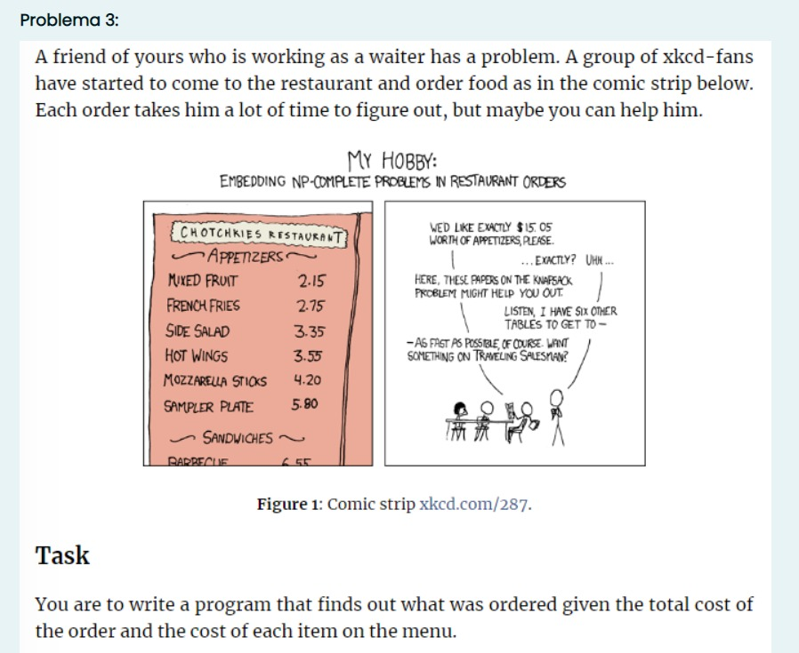

# Problema 3

## Enunciado



## Pseudocodigo
PENDIENTE

## Implementacion en C++
```c++
#include <bits/stdc++.h>
#include <vector>

using namespace std;

// Declaracion global de arreglo combinations el cual se utilizara para la evaluacion de
// casos ambiguos en knapsack
vector<string> combinations;

// Estrucuctura diseñada para el manejo de datos del algoritmo, con el fin de optimizar
// la respuesta del algoritmo al necesitar un valor de comparacion (max_value) y la
// combinacion de dinero mayor posible para cada orden (max_combi).
typedef struct
{
    int max_value;
    string max_combi;
    bool isAmbiguous;
} Answer;

// Funcion con el fin de imprimir un arreglo dados los datos (A[]) y el tamaño del mismo (n).
void printArray(int A[], int n)
{
    cout << "[";
    for (int i = 0; i < n; i++)
        cout << " " << A[i] << " ";
    cout << "]\n";
}

// Funcion con el fin de contar el numero de posibles soluciones de una sola orden.
int count(int coins[], int n, int sum)
{
    int i, j, x, y;

    // Se generara un arreglo bidimensional para el almacenamiento de todas las
    // posibles soluciones del arreglo dado el tamaño y el numero a encontrar.
    int table[sum + 1][n];

    // Se inicializan los primeros valores en 1 de cada subarreglo.
    for (i = 0; i < n; i++)
        table[0][i] = 1;

    // Se llena el resto del arreglo bidimensional desde mas hasta menos (bottom up).
    for (i = 1; i < sum + 1; i++)
    {
        for (j = 0; j < n; j++)
        {
            // Se cuentan las soluciones que incluyen el dinero del arreglo original.
            x = (i - coins[j] >= 0) ? table[i - coins[j]][j] : 0;

            // Se cuentan las soluciones excluyendo el dinero del arreglo original.
            y = (j >= 1) ? table[i][j - 1] : 0;

            // Se concatena el valor final hasta llegar a un concenso.
            table[i][j] = x + y;
        }
    }

    // Se retorna el ultimo valor de la tabla el cual indica la cantidad de soluciones posibles.
    return table[sum][n - 1];
}

// Funcion con algoritmo de knapsack, recibe los datos de precio de cada item del menu (money),
// el monto de la orden (n) y la cantidad de elementos del menu (m).
Answer knapsack(int *money, int n, int m)
{
    // Se declaran e inicializan los arreglos dp y response, los cuales contendran tanto el orden de
    // knapsack y el arreglo de combinacion ganador en caso de existir.
    int dp[n + 1] = {0};
    string response[n + 1] = {""};
    // Se delcara la variable string el cual apunta o almacena temporalmente el precio del menu
    // actual para su almacenamiento en response.
    string current;
    // Se Limpia el arreglo "combinations" por medio de la libreria <vector>,
    // con el fin de almacenar posibles combinaciones de precios del menu.
    combinations.clear();

    // Bucle for para recorrer el monto de la orden ingresada
    for (int i = 1; i <= n; i++)
    {
        // Bucle for para recorrer los montos del menu
        for (int j = 0; j < m; j++)
        {
            // Comparacion de cada precio del menu con respecto al monto de la orden actual, con el fin
            // de encontrar si cabe o no dentro de la cuenta actual.
            if (money[j] <= i)
            {
                // Se genera una cadena con los elementos actuales que caben dentro de la orden.
                current = to_string(j + 1) + ",";
                // Se compara el elemento actual en el vector de knapsack con un nuevo elemento del menu,
                // en caso de cumplir se agrega a la lista de items del menu final a mostrar.
                if (dp[i] <= money[j] + dp[i - money[j]])
                    response[i] = response[i - money[j]] + current;
                // Se compara entre los elementos actuales y sumando uno mas para encontrar el mayor posible.
                dp[i] = max(dp[i], money[j] + dp[i - money[j]]);

                // Si el indice de la orden actual es igual al monto solicitado se agrega un nuevo precio a la orden.
                if (i == n)
                {
                    combinations.push_back(response[i]);
                }
            }
        }
    }

    // Se define la cantidad de posibles soluciones de la orden.
    int possible_combinations = count(money, m, n);

    // Se delcara el objeto res que almacenara la informacion final para su retorno a la Funcion
    // main(), en este se contendra el valor final alcanzado en knapsack para definir si es posible
    // o no (res.max_value) y la mayor combinacion posible de elementos del menu (res.max_combi)
    Answer res;
    res.max_value = dp[n];
    res.max_combi = response[n];
    if (possible_combinations == 1)
        res.isAmbiguous = false;
    else
        res.isAmbiguous = true;

    // Retorno de la variable res para su deconstruccion en main()
    return res;
}

int main()
{
    // Se define el objeto a utilizar para desglosar la respuesta final de cada orden.
    Answer answer;

    // Se ingresa la cantidad de elementos n del menu.
    int n;
    do
    {
        cout << "Ingresa cuantos elementos hay en el menu: "
             << "\n";
        cin >> n;
    } while (n < 1 || n > 100);

    // Se ingresan los precios en SEK de los elementos del menu separados por espacios.
    int money[n];
    cout << "Ingrese los precios en SEK de los items del menu separados por espacios: "
         << "\n";
    for (int i = 0; i < n; i++)
        cin >> money[i];

    // Se ingresa la cantidad de ordenes m.
    int m;
    do
    {
        cout << "Ingrese la cantidad de pedidos: "
             << "\n";
        cin >> m;
    } while (m < 1 || m > 1000);

    // Se ingresan los precios de las ordenes separadas por espacios.
    int order[m];
    cout << "Ingrese el valor de los pedidos en SEK separados por espacios: "
         << "\n";
    for (int j = 0; j < m; j++)
        cin >> order[j];

    // Bucle for para recorrer el arreglo de ordenes y mostrar 3 posibles output en base
    // al resultado del algoritmo (Si es posible y su solucion, no es posible, o es posible pero ambiguo).
    for (int k = 0; k < m; k++)
    {
        answer = knapsack(money, order[k], n);

        // Se verifica si la respuesta es o no ambigua, en caso de serla solo mostraria
        // un mensaje de "Ambiguo", en caso de no serlo se haria una evaluacion adicional
        // para decidir si es o no posible.
        if (answer.isAmbiguous && answer.max_value == order[k])
        {
            cout << "El pedido de " << order[k] << "SEK es ambiguo" << endl;
        }
        else
        {
            // Casos si la respuesta no es ambigua (Si o no).
            if (answer.max_value == order[k])
                cout << "El pedido de " << order[k] << "SEK se puede realizar con los elementos del menu: [" << answer.max_combi << "]"
                     << "\n";
            else
                cout << "El pedido de " << order[k] << "SEK es imposible"
                     << "\n";
        }
    }
}
```

Ejemplo practico:
```
Input:
    n = 3
    precios = {}
```

## Modificaciones
### Modificacion 1
Dado un numero n de ordenes (1<n<100) y un precio m por orden (1<m<1000) encontrar el minimo numero de elementos de un menu disponibles dado un precio, buscando los platos mas caros que cumplan con los requisitos del precio, siguiendo la estrucutra de knapsack, es necesario un monto exacto, de caso contrario se devolvera como "imposible".
### Implementacion
Se solicitaria un minimo en lugar de un maximo al momento de la evaluacion en el algoritmo, es necesario un ajuste tambien a los argumentos del minimo, asi como inicializar el arreglo en un numero alto, generalmente se utilizaria INT_MAX para la ejecucion de esta accion.

### Modificacion 2
Se necesita un listado de todas las posibles combinaciones existentes de una misma orden, para ello se solicitan casos ambiguos al usuario, de tal forma que se puedan mostrar mas de una opcion.
### Implementacion
Se solicitarian casos ambiguos al usuario para poder crear un arreglo el cual contendra los strings posibles con las combinaciones, para ello se iran creando posterior a la evaluacion, en cada caso que la suma si sea equivalente al valor de la orden.