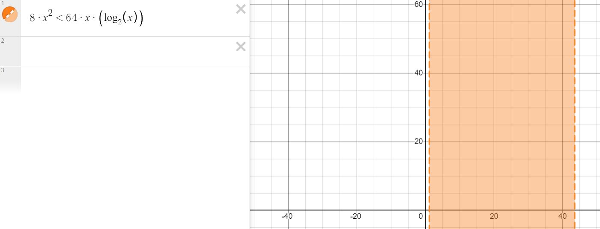
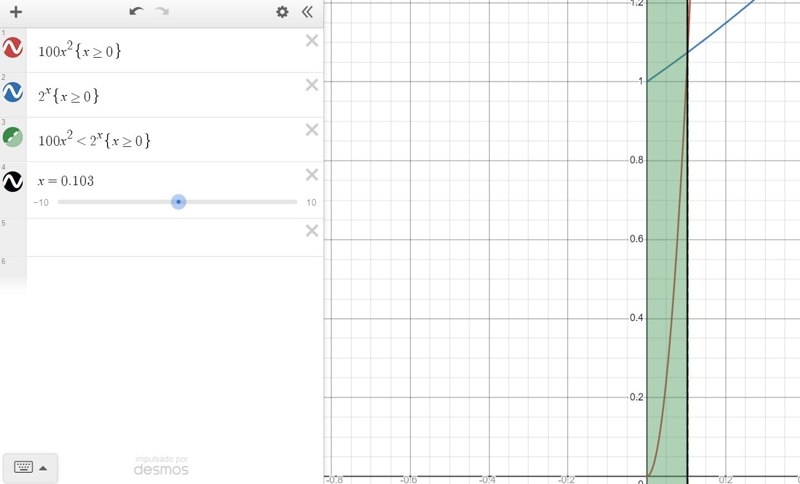

# Algorithms analysis
---
## Guide 1

1. Give at least 10 real world examples that requires sorting.
- Order deck of cards
- People in general
- Priority order
- Waiting for services

2. Other than speed, what other measures of efficiency might one use in real-world settings.
- Memory efficiency
- Work efficiency

3. Select a data structure that you have used previously, and discuss its strengths and limitations.
### Queue

#### Advantages of Queue:
- A large amount of data can be managed efficiently with ease.
- Operations such as insertion and deletion can be performed with ease as it follows the first in first out rule.
- Queues are useful when a particular service is used by multiple consumers.
- Queues are fast in speed for data inter-process communication.
- Queues can be used in the implementation of other data structures.

#### Disadvantages of Queue:
- The operations such as insertion and deletion of elements from the middle are time consuming.
- Searching an element takes O(N) time.

4. Do the following:
- Research on the shortest path problem (the problem, not the algorithm that solves it).
- Research on the traveling salesman problem (idem).
- How are these two problems similar?
- How are they different?

5. Come up with a real world problem in which only the best solution will do
- Navigation (Waze, Maps)
- Knapsack problem

6. Come up with a real world problem in which a solution that is "approximately" the best is
good enough.
- Statistics problems

7. Give an example of a software application that requires algorithms to function properly,
discuss the function of the algorithms involved.
- Queues: They set the order in waiting rooms in games.

8. Suppose we are comparing implementations of insertion sort and merge sort on the same machine. For inputs of size n, insertion sort runs in 8n^2^ steps, while merge sort runs in 64nlog~2~n steps. For which values of n does insertion sort beat merge sort?

Interval: [1.1, 43.6]

9. What is the smallest value of n such that an algorithm whose running time is 100n^2^ runs faster than an algorithm whose running time is 2^n^ on the same machine?

Value: 0.103

## Sorting Problem

1. Illustrate the execution of INSERTION-SORT on the array `A = [31, 41, 59, 26, 41, 58]`

2. Rewrite the INSERTION-SORT procedure to sort into nonincreasing instead of decreasing order.

3. Consider the searching problem:
**Input:** A sequence of n numbers `A = [a1, a2, ..., an]` and a value v.
**Output:** An index i such that `v = A[i]` or the special value NIL if v does not appear in A. Write pseudocode for linear search, which scans through the sequence, looking for v.
```
for i = 0 to A.length
    if (A[i] == v)
        return i
return NIL
```

4. Discuss whether or not the pseudocode written in the previous exercise is correct
R: I think its correct, it has efficiency of O(n).

5. Consider the problem of adding two n-bit binary integers, stored in two n-element arrays A and B. The sum of the two integers should be stored in binary form in an (n + 1)-element array C. State the problem formally and write pseudocode for adding the two integers.

```
Example:
A =    [0, 1, 1, 1]
B =    [1, 1, 1, 0]
C = [0, 0, 0, 0, 0]

Expected output:
C = [1, 0, 1, 0, 1]

n = C.length
acc = 0
for i = A.length to 1 
    sum = A[i] + B[i] + acc
    if (sum == 3)
        C[i+1] = 1
        acc = 1
    else if (sum == 2)
        C[i+1] = 0
        acc = 1
    else if (sum == 1)
        if (acc == 1)
            acc = 0 
        C[i+1] = 1
    else 
        C[i+1] = 0
C[0] = acc
```
